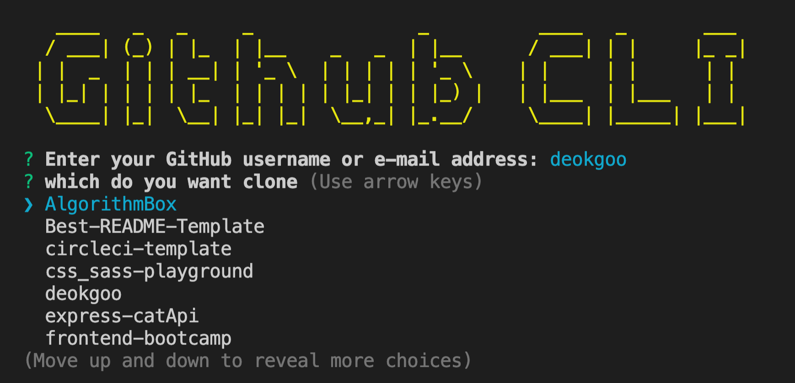

# Custom Github-CLI

This project goal is github clone using CLI.

## Description

npm 

## Getting Started

### Installing

```node
npm i 
or 
npm -g i .
```

### How To Use
```node
if you select `npm i`
npm start

or

if you select `npm -g i .`
github-cli
```

### screenshot
